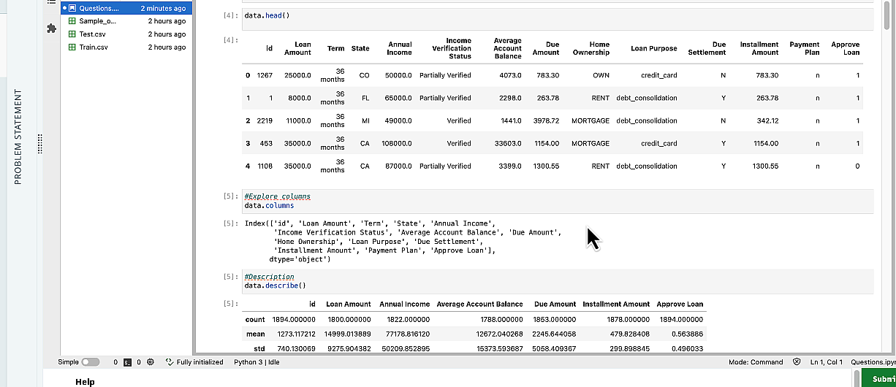
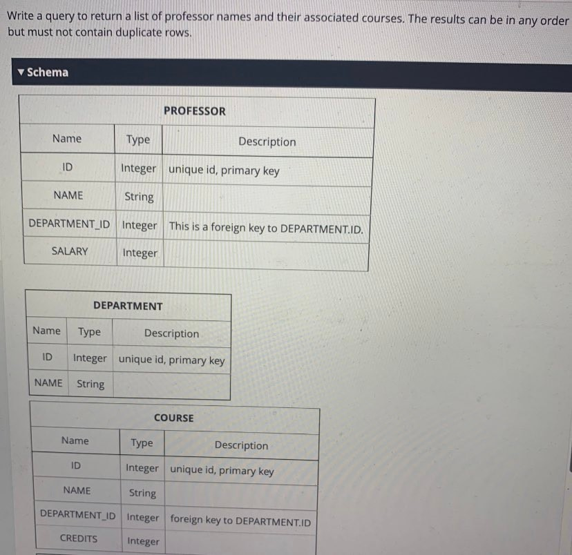

# Predict loan Approval Status
## Predict Approval Status
Iron Bank is expanding its loan origination business. They have
asked you to help develop a loan applicant evaluation model.
They have provided you with a dataset of loan applications
that were analyzed recently. It consists of loan related
information such as loan amount, tenure, suggested payment
plan, etc. It also includes applicant related information such as
applicant's state, due amounts, annual income, account
balance, etc.

Using machine learning, develop a model to predict whether a
loan should be approved. Explain how different features affect
the decisions.

Files

• Train.csv

• Test.cSv

• Sample_output.csv

**Problem**

Analyze the given data to discover how different features
relate to Approve Loan and how they impact the approval
decision. Build a machine learning model which can predict
Approve Loan. Choose appropriate evaluation criteria and
provide your reasoning.
For each record in the test set (Test.csv), predict the value of
the Approve Loan variable (0 or 1). You should submit a CSV
file named submissions.csv with a header row followed by a
row for each test entry. It should have exactly 2 columns:

• id

• Approve Loan

**Evaluation Metric**:
The metric used for evaluating the performance of the model
is its Accuracy:
Accuracy= Number of correct Predictions / Total number of
predictions Deliverables

• Well commented Jupyter notebook

•'submissions.csv"

Your Notebook should contain your solution, visualizations,
and thought process, including the top features that go into
the model. If required, please generate new features. Make
appropriate plots, annotate the notebook with markdowns,
and explain the necessary inferences. A person should be able
to read your Notebook and understand the steps are you
taking and the reasoning behind them.

### data look

# SQL query

Write a query to return a list of professor names and their associated courses. The results can be in any order
but must not contain duplicate rows.

